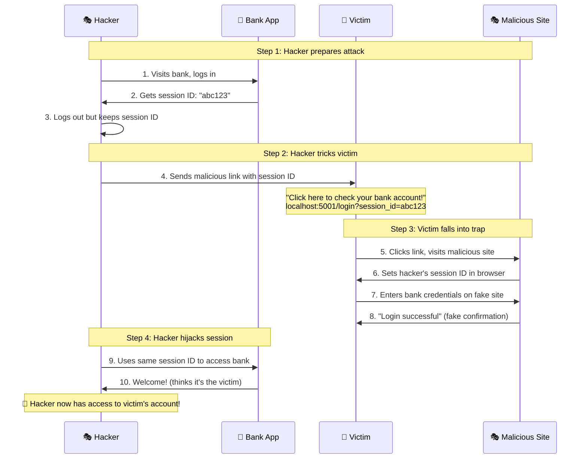

# 🍪 Session Fixation Attack Lab

A comprehensive educational lab demonstrating session fixation vulnerabilities using Flask applications with PostgreSQL database and professional UI.

## 📋 Overview

This lab provides hands-on experience with session fixation attacks, a critical web security vulnerability. You'll learn how attackers can hijack user sessions by setting a fixed session ID that victims unknowingly use when logging in.

## 🎯 Learning Objectives

- **Understand** session fixation attack mechanisms
- **Experience** a real-world attack scenario with bank login simulation
- **Analyze** how session IDs can be manipulated by attackers
- **Learn** the difference between vulnerable and secure session management
- **Test** automated attack demonstrations

## 🏗️ Project Structure

```
session_fixation_lab/
├── 📁 static/
│   ├── css/style.css              # Professional UI styling
│   └── js/app.js                  # Interactive JavaScript features
├── 📁 templates/
│   ├── bank_login.html            # Bank app login page
│   ├── bank_dashboard.html        # Bank app dashboard
│   ├── bank_register.html         # Bank app registration
│   ├── vulnerable_login.html      # Hacker's malicious site login
│   └── vulnerable_dashboard.html  # Hacker's malicious site dashboard
├── 📱 **Core Applications:**
│   ├── bank_app.py                # 🏦 Legitimate Bank Application (PORT 5000)
│   ├── vulnerable_app.py          # 🎭 Hacker's Malicious Site (PORT 5001)
│   └── database.py                # 🗄️ PostgreSQL Database Operations
├── 🔧 **Setup & Demo:**
│   ├── setup_fish.sh              # 🐟 Environment setup script
│   ├── cleanup_fish.sh            # 🧹 Cleanup script
│   ├── test_db.py                 # 🧪 Database connection test
│   └── bank_session_fixation_demo.py # 🤖 Automated attack demo
├── 🐳 **Infrastructure:**
│   ├── Dockerfile                 # PostgreSQL database setup
│   └── requirements.txt           # Python dependencies
└── 📚 README.md                   # This documentation
```

## 🚀 Quick Start

### Prerequisites

- **Python 3.8+** with pip
- **Multipass** with `k3s` instance running
- **Docker** access via multipass (using alias)

### 1️⃣ **Setup Environment**

```bash
cd session_fixation_lab

# Make scripts executable
chmod +x setup_fish.sh cleanup_fish.sh

# Run setup (creates database, virtual environment, installs dependencies)
./setup_fish.sh
```

### 2️⃣ **Test Database Connection**

```bash
# Activate virtual environment
source venv/bin/activate

# Test database
python test_db.py
```

### 3️⃣ **Start Applications**

**Terminal 1 - Bank App (Port 5000):**
```bash
source venv/bin/activate
python bank_app.py
```

**Terminal 2 - Hacker's Malicious Site (Port 5001):**
```bash
source venv/bin/activate
python vulnerable_app.py
```

### 4️⃣ **Run Automated Demo**

**Terminal 3 - Attack Demo:**
```bash
source venv/bin/activate
python bank_session_fixation_demo.py
```

## 🎭 **Attack Scenario**

### **The Setup:**
1. **🏦 Bank App** (`localhost:5000`) - Legitimate bank with secure session management
2. **🎭 Hacker's Malicious Site** (`localhost:5001`) - Fake site that captures and reuses session IDs

### **The Attack Flow:**



## 🔍 **Manual Testing**

### **Step 1: Create Bank Account**
```bash
# Visit: http://localhost:5000/bank/register
# Register with: username=victim, password=password123
```

### **Step 2: Simulate Hacker Getting Session ID**
```bash
# Visit: http://localhost:5000/bank/login
# Login with: username=hacker, password=hacker123
# Note the session ID in browser dev tools
# Logout but remember the session ID
```

### **Step 3: Victim Visits Malicious Link**
```bash
# Visit: http://localhost:5001/login?session_id=YOUR_SESSION_ID
# Login with victim credentials: username=victim, password=password123
```

### **Step 4: Hacker Hijacks Session**
```bash
# Visit: http://localhost:5000/bank/dashboard
# Use the same session ID from Step 2
# You should see victim's account information!
```

## 🔧 **Technical Details**

### **Database Schema**
```sql
CREATE TABLE users (
    id SERIAL PRIMARY KEY,
    username VARCHAR(50) UNIQUE NOT NULL,
    password_hash VARCHAR(255) NOT NULL,
    created_at TIMESTAMP DEFAULT CURRENT_TIMESTAMP
);
```

### **Key Vulnerability**
The vulnerable app **does NOT regenerate session IDs** after login:
```python
# VULNERABLE - Session ID remains the same
session['user_id'] = username  # Session ID unchanged!
```

### **Security Fix**
The bank app **regenerates session IDs** after login:
```python
# SECURE - New session ID generated
session.clear()  # Clears old session, generates new ID
session['user_id'] = username  # Fresh session ID
```

## 🧹 **Cleanup**

```bash
# Stop all applications (Ctrl+C in each terminal)

# Clean up Docker containers and virtual environment
./cleanup_fish.sh

# Remove virtual environment if needed
rm -rf venv/
```

## 🚨 **Security Warning**

⚠️ **FOR EDUCATIONAL PURPOSES ONLY**

This lab contains intentionally vulnerable code to demonstrate security flaws. **Never use this code in production environments.**

## 🎓 **Learning Outcomes**

After completing this lab, you will understand:

- ✅ How session fixation attacks work in practice
- ✅ Why session ID regeneration is critical for security
- ✅ How attackers can exploit predictable session management
- ✅ The importance of secure session configuration
- ✅ Real-world attack scenarios and prevention techniques

## 🔗 **Key Concepts**

- **Session Fixation**: Attacker sets a known session ID for the victim
- **Session Regeneration**: Creating a new session ID after authentication
- **HttpOnly Cookies**: Prevents JavaScript access to session cookies
- **SameSite Cookies**: Prevents cross-site request attacks
- **Secure Session Management**: Best practices for web application security

---

**🎯 Ready to start? Run `./setup_fish.sh` and begin your session fixation journey!** 